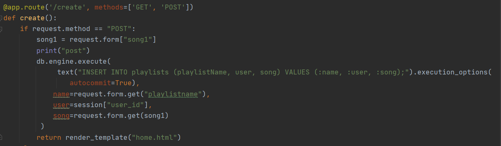
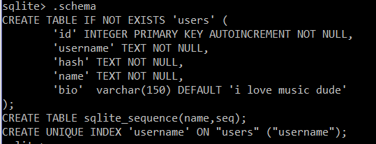

# GoodTunes
This is our second trimester project for AP CS Principles. GoodTunes is an aspiring social media platform where users can select songs from a database to create playlists, then share those playlists with others. These songs will be analyzed and be selected in the overview for a "AP CSP Wrapped."

### How to run Goodtunes
To access the website, visit http://goodtunes.cf/ (the public IP address) OR clone it on your own machine:

Install all necessary packages with `pip install -r requirements.txt`

Run using `python run.py`

# College Board 

### Inputs
There are multiple forms that the user fills out throughout the code. When signing up, the user has to meet the requirements of having a certain amount of letters and numbers in their password, and the program validates that. Once the user fills out the indicated information needed, they click the submit button and the program stores the data so the user can sign in another time using the same username and password. Find the code [here](templates/signup.html).

### Lists
Our database of songs is a list. We used a csv file and gathered songs of different genres into one database. Find the code [here](songs.csv). 

### Procedures
Each procedure in main.py renders a corresponding .html file. Different routes are used and are redirected on our website. Find the code [here](main.py).

### Outputs
Each corresponding input has it’s designated output which ranges from profile page to the formation of the playlist. Find the code [here](templates/profile.html). The Web API is used through the random user generator on our user page, which is shown in the user pages. Find the code [here](templates/wrapped.html).

### Algorithms
Our whole website demonstrates algorithms throughout by validating data prior to storage in a database. When the user makes a playlist, they click confirm when they choose the song they want to add into their playlist. In main.py under new user: [here](main.py)

# CB Big Idea Elaborations
### Big Idea 1: Creative Development

This idea is focused on the design processes and experimentation used to build projects

Project-based learning helps with Creative Development by:
- Building collaboration in our pair/share and scrum teams
    - Our team has our pair share journals as well as our individual journals with preparation to the AP exam. 
- Defining program function and purpose, delegating work and developing goals during innovation week
- Setting weekly goals while maintaining tight communication to create deliverables in Program Design and Development
    - Our [scrum board](https://github.com/sarahwxie/GoodTunes/projects/1) has been helping us keep on track with what we have completed and what we still need to get done. 
    
- Debugging our programs collaboratively to identify and correct errors
- Project-based learning gives us a freeform creative development phase that helps us develop our collaborative and imaginative skills
    - Our group had a project idea document where we planned different projects we wanted to do, and finalized on one final project, which is this project. 
### Big Idea 2: Data
- This Big Idea involves how computers store and process data, and how users interact with this data

- We’ve used Data in our programming first by:
    - Using binary and hex numbers understand how data is stored (eg. integers to 8-bit binary)
    - Understand structures for storing data (arrays, lists, tuples, dictionaries)
    - Extracting information from data (calling dictionaries from a file, indexing arrays, using nested for loops to iterate through 2D arrays)
    - Using programs with Data (having a Data.py file that is used on our Flask projects to store dictionaries that contain data)
        - In our songs.csv file we have a database of songs that is stored in SQlite where we can view the songs used and selected for each playlist. The code can be found [here](songs.csv).

We are currently attempting to add a login/sign up for our website, which would involve a user editing data

### Big Idea 3: Algorithms and Programming
This Big Idea involves how programmers can use algorithms to create programs and solve problems

- In project based learning, we’ve demonstrated use of Big Idea 3 by:
    - Breaking down problems into smaller problems
    - Programming in HTML and CSS
    - Using the building blocks Mr. Mortensen gave us in tech talks in creative ways to solve the smaller problems
    - Incorporating functions from other libraries into our code
    - Using loops, conditionals, variables, functions, lists, operations, and classes. 
    - There are several instances where we use loops. There is a loop in the playlistcreate file in the jinja, and it is a for loop where it displays all of the songs in the database. Find the code [here](playlistcreate.html). 
    - We use conditionals if the request method = get POST and we use it to validate the user information. Find the code [here](main.py).
    - We use variables throughout our code to use as a storing location for the data. In our search.html file [here](search.html), different variables such as searchSection and searchHeading are named. 
    - Our database of songs is a list. We used a csv file and gathered songs of different genres into one database. Find the code [here](songs.csv). 
    - Classes are used in our project and it creates a user-defined data structure, which holds its own data members and member functions, which can be accessed and used by creating an instance of that class. It can be found in our code [here](friends.html).

The idea of abstraction, or breaking problems into smaller pieces is how we delegate our work and create goals for different members of the scrum

### Big Idea 4: Computing Systems and Networks
This Big Idea involves how computers and computer systems transfer data, namly using the internet

- We also learned how web servers worked, ie. hosting websites on someone else’s web servers with Repl hosting
    - Our website has a public domain http://goodtunes.cf/ and is deployed on the raspberry pi
    - We learned how to configure Gunicorn & Nginx files as well
    
- We create websites that are accessible over the internet, and learned how to set up web servers with the raspberry pi
### Big Idea 5: Impact of Computing
This Big Idea involves how much computing has changed our lives, and what we need to be aware of while programming

- We need to protect our privacy and security as computer users. As computer programmers, we need to remember that we need to be aware of these security concerns and code ethically
- Everytime a user makes an account anywhere, a password needs to be created
    - In our project specifically, we set the password length to be 8-20 characters as the length and stored the password hash in a database
    - In the signup file, [here](templates/signup.html), you can see that the password needs to be confirmed in order to move onto the next step of signing up. 

# Code Review: 

* This portion of our code shows our playlist creation feature, which was the main thing that our group worked on this week
* It shows us obtaining data from a form and adding this data to the database
* This week, we created the playlist table, and figured out how to add playlists into it using an id that joins the two images

# Big Ticket Items
Note: this information can also be found on our [scrum board](https://github.com/sarahwxie/GoodTunes/projects/1)

# Further Research

### Easter Egg
Currently, access our easter egg by hovering to the left of the words "CSP Wrapped" on the navigation bar. This will lead to a page that displays the our AP Notes with our affirmations. Find it [here](templates/apjournal.html).

### Playlist Creation feature
Input an artist, title and genre, which takes an input and querries the database to add the particular song to the database.

### Homepage, Navbar, and styles
Our homepage code can be found [here](templates/home.html), our navbar code can be found [here](templates/nav.html), and our css code can be found [here](templates/styles.html).

You can evaluate this big ticket item by visiting our website (see IP above, or clone our code) and clicking through our different pages. 

All four members of our group worked on this big ticket item together. Doing this required collaboration and creativity. 

### Login/Sign Up Pages and User Dashboard
The login and signup pages can be found [here](templates/login.html) and [here](templates/signup.html). The code that leads the user to a new page after signing in can be found in [main.py](main.py). Risa and Nivu worked on this.

Evaluate this big ticket item by creating an account and signing in. 

### Search Page
The UI of the search page was done by Sarah and the page itself can be found [here](templates/search.html). Ida did the initial code that searched through the database of songs in response to user input, and Sarah added to it to create the display. The finished product that allows the user to find songs according to key words can be found in [main.py](main.py). 

Evaluate this big ticket item by searching for a song on our website. Note that we only have 400 songs currently, so you may not find what you are specifically looking for. Instead try a key word or an artist. Right now, it will only show you the first song that the loop finds, but we hope to have this fixed in the future. 

### SQLite Database
The SQLite database was created by downloading the sqlite.exe application files from the sqlite [website](https://www.sqlite.org/download.html) and creating a database with a users table. Then, signup.html was altered to include a form that posted data to main.py, which then adds the database to the table in real time using INSERT SQL statements. 

Additionally, the `werkzeug.security` module was used to hash the passwords using sha256 encryption to ensure that plaintext passwords weren't stored in the database. Finally, a custom functions file, [custom.py](custom.py) contains a function that notifies users if they are inputting incorrect information (ie. passwords don't match).

How the table was created. Note that usernames as well as user IDs must be unique.

Evaluate this big ticket item by dowloading this repo, navigating to [this directory](https://github.com/sarahwxie/GoodTunes/tree/main/models), and opening the terminal by typing `cmd` into the search bar. You can view the tables by typing ``sqlite3 myDB.db`` and then ``SELECT * FROM users; ``
You can view the automatic update feature by clicking on the **signup** button accessed via the homepage and creating an account. If you run the SELECT statement after creating an account you'll see your new account appear in the database. 

# Goals

### ✔️ Completed Goals ✔️
* Create a working flask skeleton including working backend, a base.html with a working navbar, and appropriate .css files
* Build an attractive homepage UI based on our storyboard on canva
* CSV database of 400 most popular songs in different generes with metadata that will help with analysis in the future.
* Create login and signup pages that take in user information and use it to interact with a SQL database
* Build a search page with an attractive UI that is able to search the website for songs
* Create an easter egg with a link to our AP notes

### 📝 Future Goals 📝
* Auto-generated working user dashboard that are created via the SQL database
* "Edit my user" button that leads to a page that edits user information
* Allow users to view and "follow" other users, and have this displayed on the user dashboard
* APCSP Wrapped that analyzes data after multiple users have created accounts

# Creators
Ida Mobini, Sarah Xie, Risa Iwazaki, Nivedita Rethnakar 
